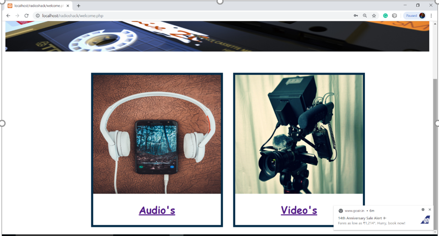
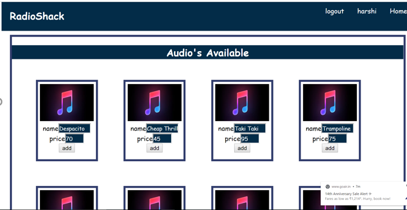
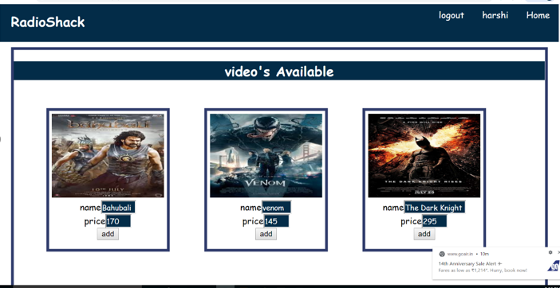
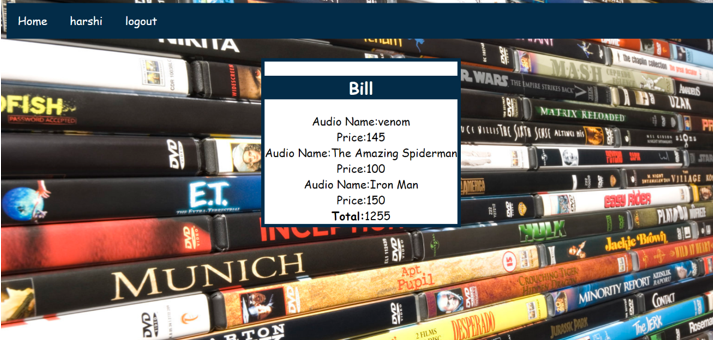

# VideoStore-Webpage
this is a web page in which fron end has been developed using HTML and backedn using MySql .
you have to install Xmapp serve and MySql to usi this.The .png/.jpg are the images which have been used to develop this web Appplication.
<b>This is how my web Application looks like after perfect implementation.</b>

